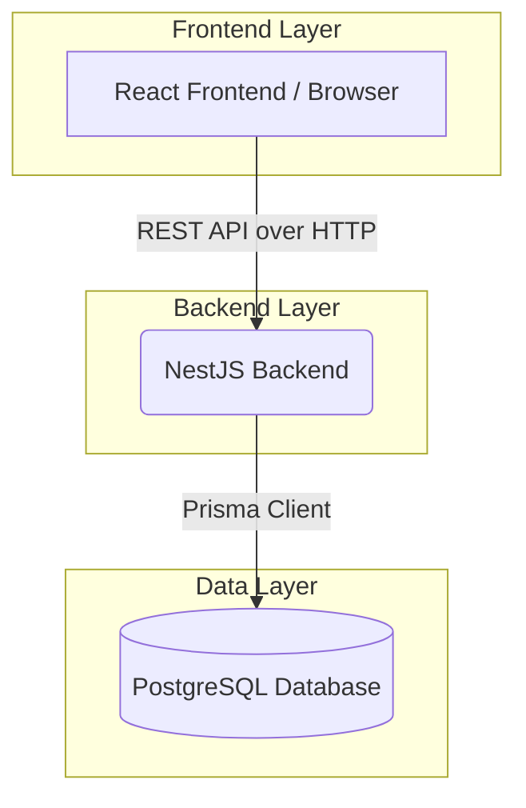

# Servexa Architecture

## 1. High-Level System Architecture
Servexa uses a modern, modular, decoupled architecture, separating the frontend presentation layer from the backend business logic and database.

## 2. Frontend Architecture (React + Vite)
- **Technology:** React 18, TypeScript, Vite, Tailwind CSS.
- **State Management:** React Context (for Auth), TanStack Query (for server state).
- **Routing:** React Router v6.
- **Component Design:** Utilizes ShadCN-like modular UI components.

## 3. Backend Architecture (NestJS)
The backend follows NestJS's standard Controller-Service-Module pattern.
- **Controllers:** Handle incoming HTTP requests and route them to appropriate services.
- **Services:** Contain the core business logic and database interaction.
- **Modules:** Encapsulate related domains (e.g., `WorkOrdersModule`, `CustomersModule`).

### Dependency Injection
NestJS's IoC (Inversion of Control) container manages the lifecycle of classes, allowing services like `PrismaService` to be injected into business logic services seamlessly.

## 4. Transaction Safety (Core Business Logic)
To ensure data integrity, critical operations use database transactions.
For example, when a Work Order is marked as completed, a single transaction handles:
1. Verifying sufficient part stock.
2. Deducting the part stock.
3. Updating the work order status.
4. Generating an unpaid invoice.

If any of these steps fail, the entire operation is rolled back, preventing orphaned records or negative inventory.
