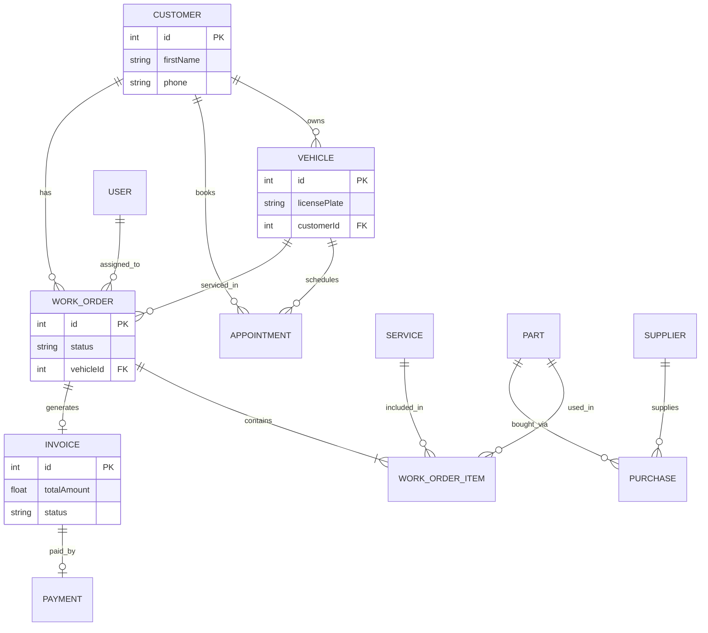

# Servexa Database Schema

## Entity Relationship Diagram (ERD)

## Normalization Details
The schema strictly adheres to 3rd Normal Form (3NF):
1. **1NF:** All attributes contain atomic values (no arrays in columns).
2. **2NF:** All non-key attributes are fully functionally dependent on the primary key. E.g., Vehicle attributes depend on `Vehicle.id`, not `Customer.id`.
3. **3NF:** No transitive dependencies. `Invoice` relies on `WorkOrder` for the subtotal calculation logic, separating billing state from service state.

## Primary & Foreign Keys
- **Primary Keys:** Every table utilizes an auto-incrementing integer `id` (or UUID for `Part`) to uniquely identify rows.
- **Foreign Keys:** Prisma manages referential integrity through foreign key constraints, preventing orphaned records (e.g., a Vehicle cannot exist without a valid Customer).
