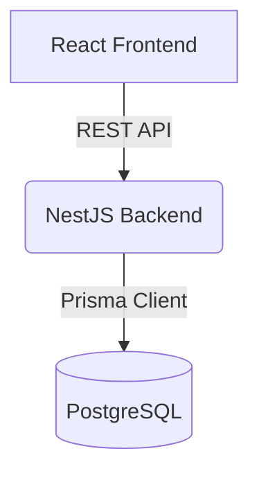
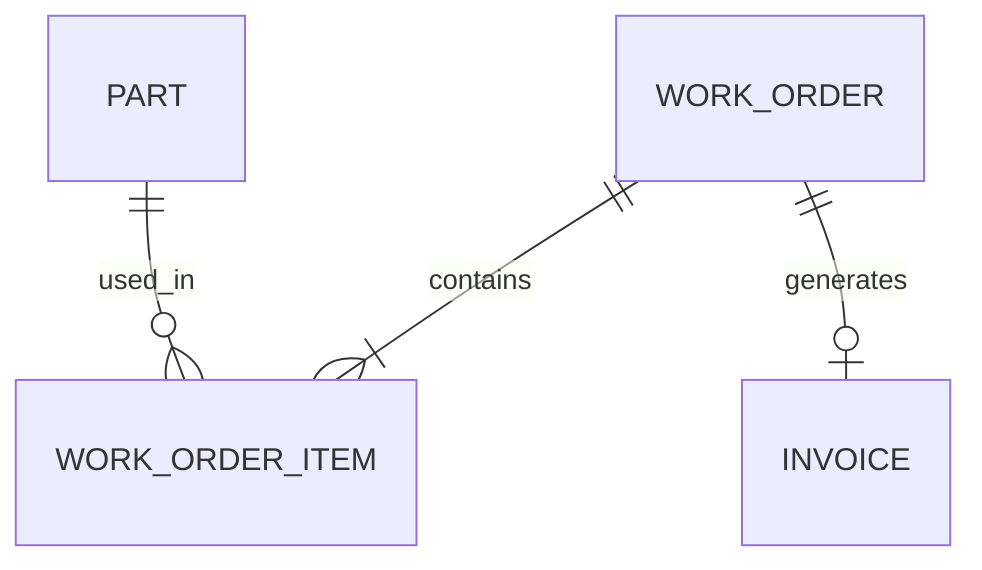

# VEHICLE SERVICE CENTER MANAGEMENT SYSTEM

## 1. Cover Page
*(To be filled by student: Project Title, Student Name, Roll No, Guide Name, College Logo)*

## 2. Certificate
This is to certify that the project entitled "Servexa - Vehicle Service Center Management System" has been successfully completed...

## 3. Declaration
I hereby declare that this project report is my original work...

## 4. Acknowledgement
I would like to express my special thanks of gratitude to...

## 5. Abstract
Servexa is a comprehensive Garange Management SaaS application designed to streamline the operations of a vehicle service center. It handles customer appointments, vehicle tracking, job card (work order) assignment, automated inventory management with transaction-safe stock deductions, and digital invoice generation.

---

# CHAPTER 1 — INTRODUCTION
## 1.1 Introduction
The Vehicle Service Center Management System (Servexa) is a modern web application built to digitize garage operations.
## 1.2 Background
Garages often rely on paper-based job cards and manual inventory tracking, leading to inefficiencies and lost revenue.
## 1.3 Problem Statement
Manual tracking of parts used in servicing vehicles causes inventory discrepancies. There is a need for a system that ties service work directly to inventory stock.
## 1.4 Motivation
To apply modern full-stack development skills (React, NestJS, PostgreSQL) to solve a real-world small business problem.
## 1.5 Objectives
- Automate Job Card creation and tracking.
- Sync inventory automatically with completed work orders.
- Generate accurate PDF invoices.
## 1.6 Scope of the Project
The system covers Admin, Service Advisor, and Mechanic workflows.
## 1.7 Target Users
Garage owners, mechanics, and service advisors.
## 1.8 Project Limitations
Does not currently support a customer-facing mobile app for online booking.
## 1.9 Organization of the Report
The report covers existing systems, requirement analysis, system design, implementation, and testing.

---

# CHAPTER 2 — EXISTING SYSTEM
## 2.1 Existing System
Most local garages use Microsoft Excel or physical ledgers.
## 2.2 Problems with Existing System
High risk of data loss, zero real-time inventory tracking, and difficult customer history lookup.
## 2.3 Limitations of Manual System
Time-consuming bill generation and no performance analytics.
## 2.4 Need for Proposed System
Servexa provides cloud-based access, automated stock deduction, and immediate invoice generation.

---

# CHAPTER 3 — PROPOSED SYSTEM
## 3.1 Proposed Solution
A centralized full-stack application using NestJS and React.
## 3.2 Features
- Role-Based Access Control
- Automated Inventory Deduction via Database Transactions
- Interactive Dashboard Analytics
## 3.3 Advantages
Eliminates manual entry errors and provides real-time business insights.
## 3.4 User Roles
Admin, Service Advisor, Mechanic.
## 3.5 System Workflow
Customer arrives -> Vehicle Registered -> Appointment Scheduled -> Work Order Created -> Mechanic Assigned -> Parts Used -> Work Completed -> Invoice Generated.
## 3.6 Project Scope
Operations within a single service center branch.

---

# CHAPTER 4 — REQUIREMENT ANALYSIS
## 4.1 Functional Requirements
- System must authenticate users via JWT.
- System must deduct inventory when a work order is completed.
## 4.2 Non-Functional Requirements
- API response time < 200ms.
- 99.9% uptime.
## 4.3 Hardware Requirements
- Server: 2GB RAM, 2 vCPU.
- Client: Any modern web browser.
## 4.4 Software Requirements
- Node.js v18+, PostgreSQL v14+.
## 4.5 User Requirements
Basic computer literacy.
## 4.6 System Requirements
PostgreSQL database and Prisma ORM for data management.

---

# CHAPTER 5 — FEASIBILITY STUDY
## 5.1 Technical Feasibility
Highly feasible using open-source tools (React, NestJS).
## 5.2 Economic Feasibility
Low cost to deploy (AWS Free Tier / Vercel / Render).
## 5.3 Operational Feasibility
Intuitive UI ensures quick adoption by garage staff.
## 5.4 Schedule Feasibility
Completed within the academic semester timeframe.
## 5.5 Feasibility Conclusion
The project is feasible across all dimensions.

---

# CHAPTER 6 — SYSTEM ANALYSIS & DESIGN
## 6.1 System Architecture

## 6.6 Use Case Diagram
- Admin: Manages Users, Views Reports.
- Advisor: Creates Work Orders, Generates Invoices.
- Mechanic: Updates Work Order Status.

## 6.10 Entity Relationship Diagram

---

# CHAPTER 7 — DATABASE DESIGN
## 7.1 Database Introduction
Relational database using PostgreSQL.
## 7.2 Database Tables
User, Role, Customer, Vehicle, WorkOrder, Part, Invoice.
## 7.7 Normalization
The database is in 3rd Normal Form (3NF) to eliminate data redundancy.

---

# CHAPTER 8 — TECHNOLOGY USED
## 8.1 React
Frontend UI library.
## 8.2 TypeScript
Provides static typing for robust code.
## 8.3 Node.js
JavaScript runtime environment.
## 8.4 NestJS (replaces Express.js)
Enterprise-grade Node.js framework.
## 8.5 PostgreSQL
Relational database.
## 8.6 Prisma
Type-safe Database ORM.
## 8.7 Tailwind CSS
Utility-first styling framework.
## 8.8 REST API
Stateless communication architecture.
## 8.9 JWT
JSON Web Tokens for secure authentication.

---

# CHAPTER 9 — SYSTEM IMPLEMENTATION
## 9.1 Project Structure
Monorepo using Turborepo (apps/backend, apps/frontend).
## 9.8 Work Order Module
Core logic implemented using Prisma `$transaction` to ensure inventory is securely deducted only when a job is marked "COMPLETED".

---

# CHAPTER 10 — USER INTERFACE
*(Placeholder for Screenshots)*
- 10.1 Login Screen
- 10.2 Dashboard
- 10.6 Work Order Kanban Board

---

# CHAPTER 11 — TESTING
## 11.3 Unit Testing
Jest used for backend services.
## 11.7 Test Cases
- TC01: Prevent Work Order completion if Part stock < requested quantity (Pass).
- TC02: Auto-generate Invoice on Work Order completion (Pass).

---

# CHAPTER 12 — RESULTS & DISCUSSION
## 12.1 System Results
The system successfully processed end-to-end garage workflows during local testing.

---

# CHAPTER 13 — SECURITY
## 13.1 Authentication
Passport.js JWT Strategy.
## 13.4 Input Validation
Class-validator decorators enforce strict DTO validation at the API boundary.

---

# CHAPTER 14 — ADVANTAGES & LIMITATIONS
## 14.1 Advantages
Zero data discrepancy between billing and inventory.
## 14.2 Limitations
Offline mode is not supported.

---

# CHAPTER 15 — FUTURE SCOPE
- 15.1 Mobile Application for Mechanics
- 15.2 Customer Online Booking Portal

---

# CHAPTER 16 — CONCLUSION
The Servexa project successfully digitized the core operations of a vehicle service center, providing a robust, transaction-safe backend and an intuitive React frontend, fulfilling all academic requirements for the BCA final year project.

---
# APPENDIX
A. Database Schema (Prisma)
B. API List (Servexa REST endpoints)
F. Source Code Structure (Monorepo)
