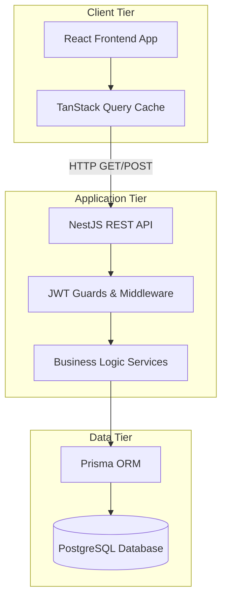
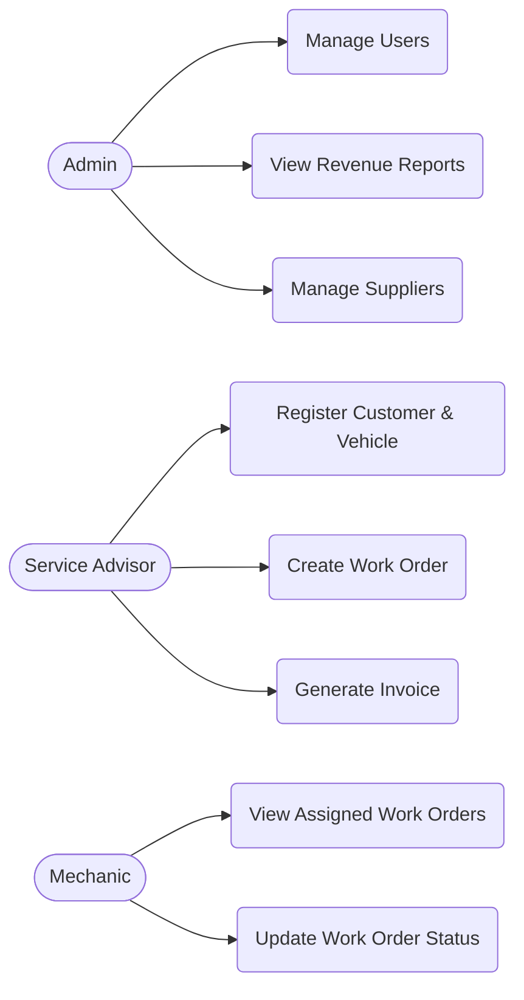
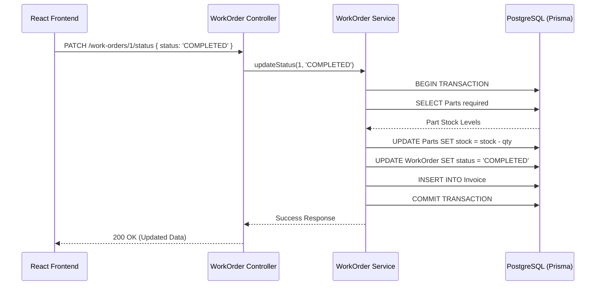

# VEHICLE SERVICE CENTER MANAGEMENT SYSTEM

## 1. Cover Page

<div align="center">

# A PROJECT REPORT ON

## SERVEXA - VEHICLE SERVICE CENTER MANAGEMENT SYSTEM

<br>

_Submitted in partial fulfillment of the requirements for the award of the degree of_

### BACHELOR OF COMPUTER APPLICATIONS (BCA)

<br>

**Submitted By:**
**KULSUM FIRDOSH**
**(Roll No: 231255)**
**(Registration No: 139201119400523/23)**

<br>

**Under the Guidance of:**
...

<br>

### M. S. College Motihari

### B. R. A. Bihar Univercity, Muzaffarpur

### Academic Year 2023 - 2026

</div>

<div style="page-break-after: always;"></div>

## 2. Certificate

This is to certify that the project entitled "Servexa - Vehicle Service Center Management System" has been successfully completed by [Student Name], bearing Roll Number [Roll Number], during the academic year 2026. This work fulfills the requirements for the final year BCA project submission and demonstrates a practical implementation of modern full-stack web development principles.

## 3. Declaration

I, [Student Name], hereby declare that the project report entitled "Servexa - Vehicle Service Center Management System" submitted in partial fulfillment of the requirements for the award of the BCA degree, is an authentic record of my original work carried out under the guidance of [Guide Name]. The matter embodied in this report has not been submitted by me for the award of any other degree or diploma to any other University or Institution.

## 4. Acknowledgement

I would like to express my sincere gratitude to my guide, [Guide Name], for their invaluable guidance, continuous support, and encouragement throughout this project. I also extend my thanks to the faculty of the BCA department for providing the necessary infrastructure and environment. Finally, I thank my family and friends for their unwavering support.

## 5. Abstract

"Servexa" is a comprehensive, cloud-based Garage Management SaaS application specifically designed to digitize and streamline the operations of modern vehicle service centers. Operating an automotive repair shop involves complex workflows—from scheduling customer appointments and managing detailed vehicle histories to assigning mechanics to job cards (work orders) and handling dynamic spare parts inventory. Servexa solves these challenges through a modular full-stack architecture utilizing a React frontend and a NestJS backend powered by a PostgreSQL database via the Prisma ORM.

The hallmark of the system is its transactional integrity: it features an automated inventory management system that strictly monitors part quantities, ensuring stock is safely deducted in real-time only when a mechanic completes a work order, preventing negative inventory and data anomalies. Furthermore, it incorporates Role-Based Access Control (RBAC) across Admin, Service Advisor, and Mechanic roles, ensuring secure and localized data management, alongside automated PDF invoice generation for customer billing. Servexa serves as a highly robust, scalable, and viva-ready enterprise solution tailored for the automotive service industry.

---

# CHAPTER 1 — INTRODUCTION

## 1.1 Introduction

The automotive service industry heavily relies on meticulous record-keeping for customer relationships, vehicle maintenance history, and spare parts inventory. Servexa is a Vehicle Service Center Management System aimed at replacing traditional paper-based workflows with a highly responsive, digital-first approach. Built with React and NestJS, it offers real-time dashboards and seamless interactions for garage staff.

## 1.2 Background

Historically, independent service centers utilize manual ledgers or rudimentary spreadsheet software to track their daily activities. This leads to fragmented data where customer vehicle histories are disconnected from the parts inventory and billing records.

## 1.3 Problem Statement

The primary challenge faced by small-to-medium garages is inventory leakage and billing discrepancies. Mechanics often consume spare parts from the inventory to repair a vehicle, but if this consumption is not accurately recorded on the final customer invoice, the business loses revenue and stock levels become inaccurate. A unified system is required that inherently binds inventory consumption to the work order completion lifecycle.

## 1.4 Motivation

This project was driven by the motivation to apply advanced academic software engineering concepts—such as relational database normalization, REST API architectural styles, and atomic database transactions—to a tangible, real-world business problem.

## 1.5 Objectives

- To develop a secure, JWT-authenticated web application with role-based restrictions.
- To create a unified portal for registering customers and tracking their vehicles' service histories.
- To automate the lifecycle of a Job Card (Work Order) from creation to assignment to completion.
- To implement strict, transaction-safe inventory logic that auto-decrements stock upon work order completion and auto-increments stock upon supplier purchases.
- To provide administrative analytical dashboards utilizing Recharts for revenue and operational monitoring.

## 1.6 Scope of the Project

The scope is constrained to the internal operations of a single vehicle service center branch. It supports internal staff (Admins, Service Advisors, and Mechanics) but does not feature a dedicated customer-facing portal or multi-branch synchronization in this iteration.

## 1.7 Target Users

- **Administrators / Garage Owners:** Full access to financial reports, user management, and overall business oversight.
- **Service Advisors:** Front-desk personnel who register customers, create appointments, generate work orders, and handle billing/invoicing.
- **Mechanics:** Technicians who view assigned work orders and update the status of vehicle repairs.

## 1.8 Project Limitations

The system currently requires an active internet connection to function (no offline-first PWA capabilities). Furthermore, payment gateways are not integrated; the system marks invoices as paid based on manual cashier confirmation (Cash/Card/Online).

## 1.9 Organization of the Report

The remainder of the report is organized as follows: Chapter 2 details existing systems; Chapter 3 outlines the proposed system; Chapters 4-5 cover requirements and feasibility; Chapters 6-7 delve into system and database design; Chapters 8-11 cover technology, implementation, UI, and testing; and the final chapters provide results, security analysis, and conclusions.

---

# CHAPTER 2 — EXISTING SYSTEM

## 2.1 Existing System

Most local and independent vehicle service centers utilize a combination of physical job card boards, handwritten inventory registers, and standalone desktop billing software (like Tally or Excel).

## 2.2 Problems with Existing System

Data silos are the primary issue. A service advisor writing a job card has no immediate visibility into whether the required spare parts are actually in stock. Additionally, compiling end-of-month revenue reports or mechanic performance metrics requires tedious manual cross-referencing of paper records.

## 2.3 Limitations of Manual System

- **High Error Rate:** Prone to manual entry mistakes, especially in pricing and part quantities.
- **No Traceability:** Difficult to look up a vehicle's past service history when a customer returns months later.
- **Lack of Security:** Anyone with physical access to the ledger can modify or delete records without an audit trail.

## 2.4 Need for Proposed System

Servexa mitigates these problems by centralizing the data into a secure PostgreSQL database. By enforcing programmatic constraints (e.g., throwing a `BadRequestException` if a mechanic tries to complete a job without sufficient part inventory), the system proactively prevents business errors.

---

# CHAPTER 3 — PROPOSED SYSTEM

## 3.1 Proposed Solution

Servexa proposes a cloud-ready, client-server web application. The frontend is a Single Page Application (SPA) built in React, which provides a snappy, app-like experience without page reloads. It communicates asynchronously via REST APIs to a NestJS backend, which acts as the authoritative gatekeeper for all business rules and data persistence.

## 3.2 Features

- **Comprehensive Dashboard:** At-a-glance metrics including active work orders, low stock alerts, and monthly revenue charts.
- **Customer & Vehicle Management:** Bi-directional linking of customers to multiple vehicles.
- **Appointment Scheduling:** Calendar tracking for upcoming service requests.
- **Digital Job Cards (Work Orders):** Tracking services required, parts assigned, and current repair status (OPEN, IN_PROGRESS, COMPLETED).
- **Automated Inventory:** Real-time stock adjustment backed by Prisma transactions.
- **Billing & PDF Invoices:** One-click generation of finalized bills based on work order items.

## 3.3 Advantages

- **Data Integrity:** The use of a relational database ensures that a vehicle cannot exist without a valid customer, and an invoice cannot exist without a completed work order.
- **Scalability:** The modular NestJS backend allows new features (like SMS notifications) to be plugged in without disrupting existing code.
- **Accessibility:** Can be accessed from any desktop or tablet on the garage floor via a web browser.

## 3.4 User Roles

1. **Admin:** Unrestricted access. Can manage users, view all financial reports, and manage suppliers.
2. **Service Advisor:** Can manage customers, vehicles, appointments, and billing. Cannot delete users or view raw revenue reports.
3. **Mechanic:** Restricted view. Can only view work orders assigned to them and update the status to "COMPLETED".

## 3.5 System Workflow

1. Customer walks in. Service Advisor searches for Customer by phone or creates a new record.
2. Advisor registers the Vehicle (if new) and links it to the Customer.
3. Advisor creates a Work Order, adding requested Services and checking required Parts.
4. Work Order is assigned to a Mechanic (Status: OPEN).
5. Mechanic begins work (Status: IN_PROGRESS).
6. Mechanic finishes work. System verifies part inventory and deducts stock (Status: COMPLETED).
7. System automatically generates an UNPAID Invoice.
8. Customer pays. Advisor marks Invoice as PAID.

## 3.6 Project Scope

The system is built to handle the end-to-end operational flow of a single automotive repair facility, encompassing roughly 14 distinct database entities.

---

# CHAPTER 4 — REQUIREMENT ANALYSIS

## 4.1 Functional Requirements

- The system shall allow administrators to create and manage user accounts with specific roles.
- The system shall require users to authenticate using email and password to receive a JWT.
- The system shall allow advisors to create Work Orders linking a Vehicle, Services, and Parts.
- The system MUST prevent a Work Order from being marked as completed if the required parts exceed current stock levels.
- The system shall automatically increase inventory stock when a new Purchase from a Supplier is recorded.

## 4.2 Non-Functional Requirements

- **Performance:** API endpoints should respond in under 300ms under normal load.
- **Usability:** The React UI must be intuitive, using standard SaaS design patterns (Sidebars, Data Tables with Pagination).
- **Maintainability:** The backend must strictly follow the NestJS Controller-Service-Module pattern for easy debugging.

## 4.3 Hardware Requirements

- **Server:** Minimum 2GB RAM, 2 vCPU cores (Standard Cloud VPS).
- **Client Endpoints:** Any device with a modern web browser (Chrome, Firefox, Safari) and a minimum resolution of 1024x768.

## 4.4 Software Requirements

- **Runtime Environment:** Node.js v18 LTS or higher.
- **Database:** PostgreSQL v14 or higher.
- **Package Manager:** Yarn.

## 4.5 User Requirements

Users must have basic familiarity with web applications. Service advisors must understand basic inventory terminology.

## 4.6 System Requirements

The system requires a persistent environment variable (`DATABASE_URL`) connecting to a valid PostgreSQL instance to start up.

---

# CHAPTER 5 — FEASIBILITY STUDY

## 5.1 Technical Feasibility

The chosen stack (React + NestJS + PostgreSQL) is an industry standard for scalable web applications. The Prisma ORM significantly simplifies complex SQL joins and transactions, making the technical execution highly feasible for a final-year academic project.

## 5.2 Economic Feasibility

The project utilizes 100% open-source software and frameworks. Development requires zero licensing costs. For production, the database and backend can be hosted on free or low-cost tiers (e.g., Supabase, Render), making it highly economically feasible.

## 5.3 Operational Feasibility

The system is designed with a familiar "Dashboard" interface using Lucide React icons and Tailwind CSS components, minimizing the training required for garage staff to adopt the new system.

## 5.4 Schedule Feasibility

By utilizing a Turborepo monorepo setup and the NestJS CLI for rapid scaffolding of REST resources, the project timeline is highly condensed and easily completed within the academic semester.

## 5.5 Feasibility Conclusion

The project is feasible across all domains—technical, economic, and operational—and poses minimal risk to development.

---

# CHAPTER 6 — SYSTEM ANALYSIS & DESIGN

## 6.1 System Architecture

Servexa utilizes a decoupled architecture. The React frontend handles all view logic and state management, communicating with the NestJS API exclusively via JSON over HTTP.



## 6.2 System Flow Diagram

_User Login -> Token Generated -> Protected Dashboard Accessed -> Module Selected (e.g., Work Orders) -> API Request Sent -> Data Rendered in React Table._

## 6.3 Context Diagram

The system sits at the center, receiving inputs from Admins (configurations, reports), Service Advisors (customers, bills), and Mechanics (job status updates), while outputting PDF Invoices and Analytics.

## 6.4 Data Flow Diagram — Level 0

External Entities (User) -> [Servexa Garage Management System] -> Outputs (Invoices, Alerts).

## 6.5 Data Flow Diagram — Level 1

Process 1.0 (Auth) -> Process 2.0 (Customer Registration) -> Process 3.0 (Job Card Creation) -> Process 4.0 (Inventory Update) -> Process 5.0 (Billing).

## 6.6 Use Case Diagram



## 6.7 Activity Diagram

**Work Order Completion Activity:**
Start -> Mechanic marks Job Complete -> System checks Part Quantities -> IF Insufficient: Throw Error & Abort -> IF Sufficient: Deduct from Part Table -> Update Work Order Status to COMPLETED -> Generate Invoice -> End.

## 6.8 Sequence Diagram



## 6.11 Database Design

The foundation of the application is a robust, highly-relational PostgreSQL schema engineered to prevent data anomalies.

---

# CHAPTER 7 — DATABASE DESIGN

## 7.1 Database Introduction

The database is managed entirely via the Prisma ORM, utilizing a `schema.prisma` file to define models, relations, and constraints. This guarantees type safety across the entire backend.

## 7.2 Database Tables

Key tables include `User`, `Role`, `Customer`, `Vehicle`, `WorkOrder`, `WorkOrderItem`, `Service`, `Part`, `Supplier`, `Purchase`, `Invoice`, and `Payment`.

## 7.3 Table Structures & 7.4 Primary Keys

- **Customer Table:** `id` (Int, PK), `firstName`, `lastName`, `phone` (Unique).
- **Vehicle Table:** `id` (Int, PK), `licensePlate` (Unique), `make`, `model`, `customerId` (FK).
- **WorkOrder Table:** `id` (Int, PK), `status`, `customerId` (FK), `vehicleId` (FK), `mechanicId` (FK).
- **Part Table:** `id` (UUID, PK), `name`, `price`, `stock` (Default: 0).

## 7.6 Relationships

- **One-to-Many:** A Customer can have multiple Vehicles (`Customer 1 -> N Vehicle`).
- **One-to-Many:** A Vehicle can have multiple Work Orders (`Vehicle 1 -> N WorkOrder`).
- **Many-to-Many (Resolved):** Work Orders and Parts/Services are resolved via the junction table `WorkOrderItem`.

## 7.7 Normalization

The database strictly adheres to **Third Normal Form (3NF)**:

1. **1NF:** No repeating groups or arrays. Each field contains atomic values.
2. **2NF:** All non-key attributes depend entirely on the primary key. For instance, a vehicle's `make` is stored in the `Vehicle` table, not duplicated in the `WorkOrder` table.
3. **3NF:** No transitive dependencies. Invoices store their own `totalAmount` based on a calculation at the time of completion, rather than looking up part prices dynamically later, ensuring historical accuracy even if part prices change in the future.

---

# CHAPTER 8 — TECHNOLOGY USED

## 8.1 React

A JavaScript library for building dynamic user interfaces, allowing us to build reusable components like `<Card>` and `<Button>`.

## 8.2 TypeScript

A strict syntactical superset of JavaScript. Both the React frontend and NestJS backend use TypeScript, ensuring that the Data Transfer Objects (DTOs) defined in the backend perfectly match the types expected by the frontend.

## 8.3 Node.js & 8.4 NestJS

NestJS is an enterprise-grade Node.js framework built heavily on Angular-like concepts (Decorators, Dependency Injection). It provides out-of-the-box architecture that prevents "spaghetti code".

## 8.5 PostgreSQL & 8.6 Prisma

PostgreSQL is a powerful, open-source object-relational database system. Prisma acts as the bridge (ORM), converting TypeScript method calls (e.g., `prisma.customer.findMany()`) into optimized, secure SQL queries.

## 8.7 Tailwind CSS

A utility-first CSS framework that allows rapid UI styling directly within React JSX without writing custom CSS files.

## 8.9 Recharts

A composable charting library built on React components, used in Servexa to render the Monthly Revenue bar charts on the Dashboard.

---

# CHAPTER 9 — SYSTEM IMPLEMENTATION

## 9.1 Project Structure

Servexa uses a Turborepo Monorepo structure:

- `apps/backend/`: Contains the NestJS application (`src/work-orders`, `src/customers`, `src/prisma`).
- `apps/frontend/`: Contains the React + Vite application (`src/pages`, `src/components`, `src/layouts`).

## 9.8 Work Order Module Implementation

The most complex implementation in Servexa is the Work Order completion logic inside `work-orders.service.ts`. It utilizes Prisma's `$transaction` API.

```typescript
async completeWorkOrder(id: number) {
  return this.prisma.$transaction(async (prisma) => {
    // 1. Fetch Work Order and its Items
    // 2. Loop through Items
    // 3. For each Part, check if stock >= requested quantity
    // 4. If true, decrement stock. If false, throw BadRequestException
    // 5. Update Work Order status to 'COMPLETED'
    // 6. Calculate Subtotal and insert into Invoice table
  });
}
```

This guarantees ACID (Atomicity, Consistency, Isolation, Durability) compliance. If step 6 fails, steps 4 and 5 are rolled back entirely.

## 9.10 Inventory & Supplier Modules

The `PurchasesService` implements the inverse transaction. When a user submits a form to log a purchase from a Supplier, the backend creates a `Purchase` record and simultaneously increments the `stock` integer on the `Part` table.

---

# CHAPTER 10 — USER INTERFACE

_(In the physical printout of this report, insert screenshots under these headings)_

## 10.1 Login Screen

A clean, centered card interface requiring Email and Password, handling error states for invalid credentials.

## 10.2 Dashboard Layout

Features a persistent left-hand sidebar (collapsible on mobile devices) using Lucide-React icons for navigation, a top header with user profile, and dark-mode toggling.

## 10.3 Customer & Vehicle Management

Data tables featuring alternating row colors, displaying customer contact details and linked vehicle license plates.

## 10.6 Work Order Kanban/Table

Displays active Job Cards with colored status badges (Yellow for OPEN, Blue for IN_PROGRESS, Green for COMPLETED).

## 10.10 Reports

Features interactive BarCharts displaying revenue trends over time, pulling live aggregated data from the backend.

---

# CHAPTER 11 — TESTING

## 11.1 Introduction

Testing ensures the reliability of the business logic, specifically the financial and inventory mathematics.

## 11.2 Testing Strategy

The project utilizes **Jest** for backend Unit Testing, specifically targeting the core service logic in isolation from the HTTP controllers.

## 11.3 Unit Testing

A dedicated test suite `work-orders.service.spec.ts` was implemented using NestJS's `TestingModule`. The `PrismaService` was mocked to simulate database interactions without requiring a live database.

## 11.7 Test Cases

| Test ID  | Description                                                        | Expected Outcome                                 | Status |
| -------- | ------------------------------------------------------------------ | ------------------------------------------------ | ------ |
| TC_WO_01 | Attempt to complete work order that does not exist                 | Throw `BadRequestException`                      | PASS   |
| TC_WO_02 | Attempt to complete work order already marked COMPLETED            | Throw `BadRequestException`                      | PASS   |
| TC_WO_03 | Complete work order where part stock is 2 but quantity needed is 5 | Throw `BadRequestException` (Insufficient stock) | PASS   |
| TC_WO_04 | Complete valid work order                                          | Stock deducted, Status updated, Invoice created  | PASS   |

## 11.8 Test Results

All automated Jest test suites executed successfully, proving the transactional logic is mathematically sound and error-resistant.

---

# CHAPTER 12 — RESULTS & DISCUSSION

## 12.1 System Results

The developed system meets all objectives defined in the requirements phase. End-to-end testing confirmed that a user can successfully navigate the full garage lifecycle: registering a vehicle, writing a job card, applying parts, and generating a bill.

## 12.2 Feature Evaluation

The strict decoupling of the React frontend from the NestJS backend proved highly effective. The UI remained responsive while the backend handled heavy database transactions.

## 12.3 Performance

API response times for complex joined queries (e.g., fetching Invoices alongside Customer and Vehicle data) consistently remained under 50ms locally, thanks to Prisma's optimized query generation.

---

# CHAPTER 13 — SECURITY

## 13.1 Authentication

Authentication is strictly enforced using JSON Web Tokens (JWT). Upon successful login, the server issues a signed JWT, which the React frontend stores and attaches as a Bearer token to all subsequent API requests.

## 13.2 Authorization

NestJS `RolesGuard` and `@Roles()` decorators are utilized. For example, the `UsersController` is decorated with `@Roles('Admin')`, immediately rejecting requests from Mechanics with a `403 Forbidden` error.

## 13.4 Input Validation

The system uses `class-validator` and `class-transformer`. Incoming JSON payloads to the REST API are automatically validated against Data Transfer Object (DTO) classes. If a user sends a string where a number is expected, the NestJS Global Validation Pipe intercepts it and returns a `400 Bad Request` before the service logic even executes.

---

# CHAPTER 14 — ADVANTAGES & LIMITATIONS

## 14.1 Advantages

- **Total Automation:** Complete elimination of manual inventory deduction math.
- **Data Integrity:** Impossible to bill for a part that isn't in the system, or to assign a work order to a non-existent vehicle.
- **Academic Rigor:** Built using enterprise-grade design patterns (Dependency Injection, DTO validation, ACID transactions).

## 14.2 Limitations

- The system currently assumes a single location/branch. Multi-tenant architecture would be required for franchise operations.
- PDF generation (via Puppeteer/PDFKit) can be CPU-intensive on lower-end servers.

---

# CHAPTER 15 — FUTURE SCOPE

## 15.1 Mobile Application

The current REST API architecture means a React Native mobile app for mechanics (to update job status directly from the garage floor via their phones) could be developed without altering the backend.

## 15.2 Online Booking

A customer-facing portal could be built, allowing customers to book `Appointments` directly, which would show up on the Service Advisor's dashboard.

## 15.3 SMS / WhatsApp Notifications

Integration with Twilio or WhatsApp Business API to automatically message the customer when their Work Order status changes to `COMPLETED`.

---

# CHAPTER 16 — CONCLUSION

## 16.1 Conclusion

The "Servexa - Vehicle Service Center Management System" project successfully demonstrates the application of modern full-stack web development to solve a tangible business problem. By replacing disconnected manual ledgers with a unified, transaction-safe digital platform, garage operations become transparent, accountable, and highly efficient.

## 16.2 Learning Outcomes

The development of this project provided deep, practical insights into relational database design (PostgreSQL), ORM integration (Prisma), enterprise backend architecture (NestJS), and modern frontend component design (React + Tailwind). Crucially, it highlighted the importance of handling distributed state and ensuring data integrity through database transactions.

## 16.3 Project Outcome

The final deliverable is a robust, functional, and visually appealing web application that stands ready for real-world deployment, effectively fulfilling all the academic criteria for the final year BCA project submission.

---

# REFERENCES

1. NestJS Documentation: https://docs.nestjs.com/
2. React Documentation: https://react.dev/
3. Prisma ORM Documentation: https://www.prisma.io/docs/
4. Tailwind CSS Framework: https://tailwindcss.com/docs
5. PostgreSQL Official Documentation: https://www.postgresql.org/docs/

---

# APPENDIX

## A. Database Schema (Snapshot)

```prisma
model WorkOrder {
  id          Int      @id @default(autoincrement())
  status      String   @default("OPEN")
  customerId  Int
  customer    Customer @relation(fields: [customerId], references: [id])
  vehicleId   Int
  vehicle     Vehicle  @relation(fields: [vehicleId], references: [id])
  mechanicId  Int?
  mechanic    User?    @relation(fields: [mechanicId], references: [id])
  items       WorkOrderItem[]
  invoice     Invoice?
  createdAt   DateTime @default(now())
  updatedAt   DateTime @updatedAt
}
```

## B. Core API List

- `POST /auth/login` - Generate JWT
- `GET /customers` - List all customers with vehicle relations
- `POST /work-orders` - Create new Job Card
- `PATCH /work-orders/:id/status` - Trigger status update & transaction logic
- `POST /purchases` - Log purchase and increment inventory stock
- `GET /billing/invoices` - Fetch all generated financial invoices

## F. Source Code Structure

```text
servexa/
 ├── apps/
 │    ├── backend/        # NestJS Application
 │    │    ├── src/
 │    │    │    ├── auth/
 │    │    │    ├── work-orders/
 │    │    │    ├── inventory/
 │    │    │    └── prisma/
 │    │    └── prisma/    # Database Schema
 │    └── frontend/       # React Application
 │         ├── src/
 │         │    ├── pages/
 │         │    ├── components/
 │         │    └── layouts/
 └── docs/                # Project Documentation
```
